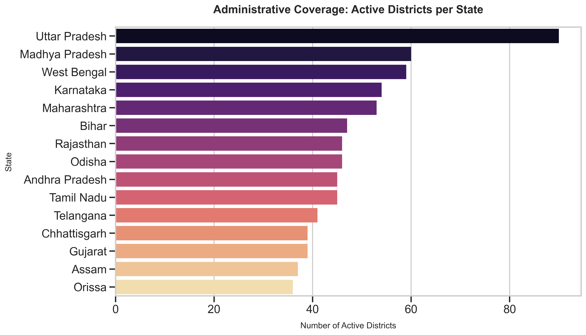
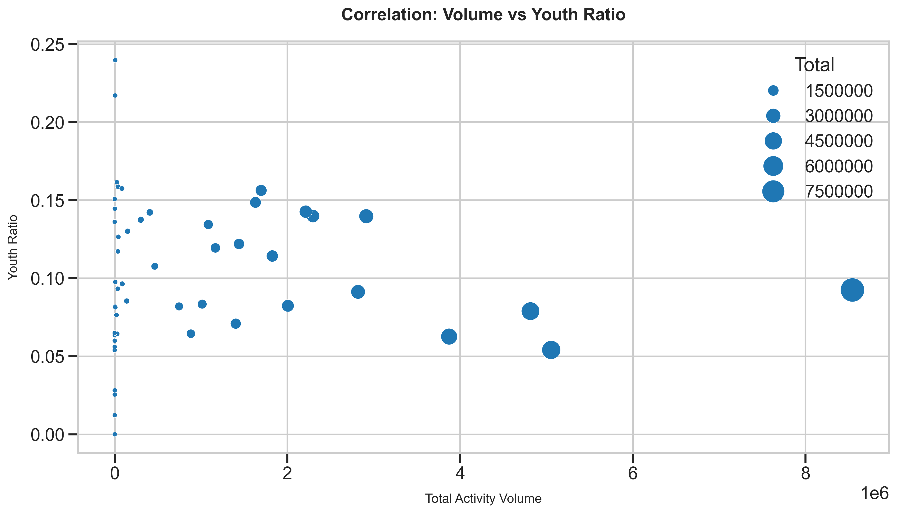
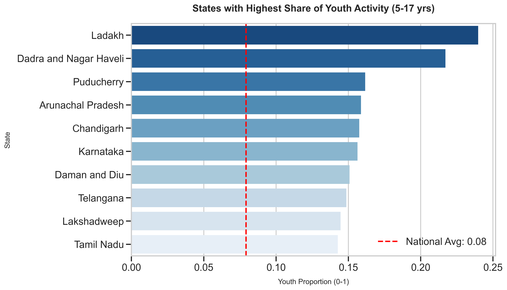
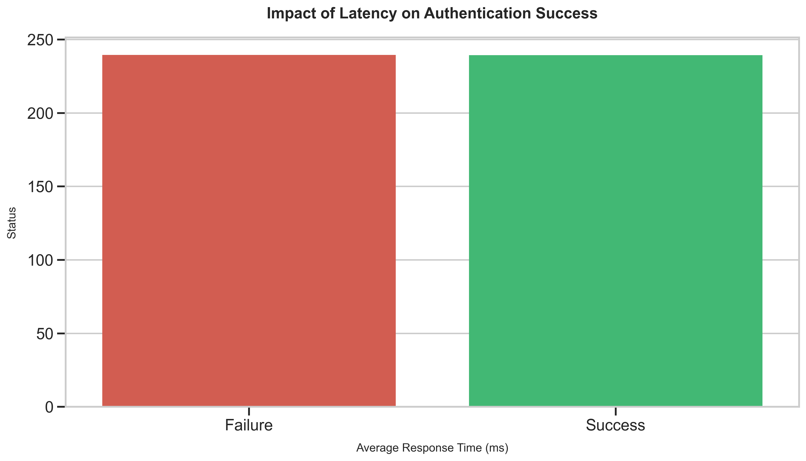
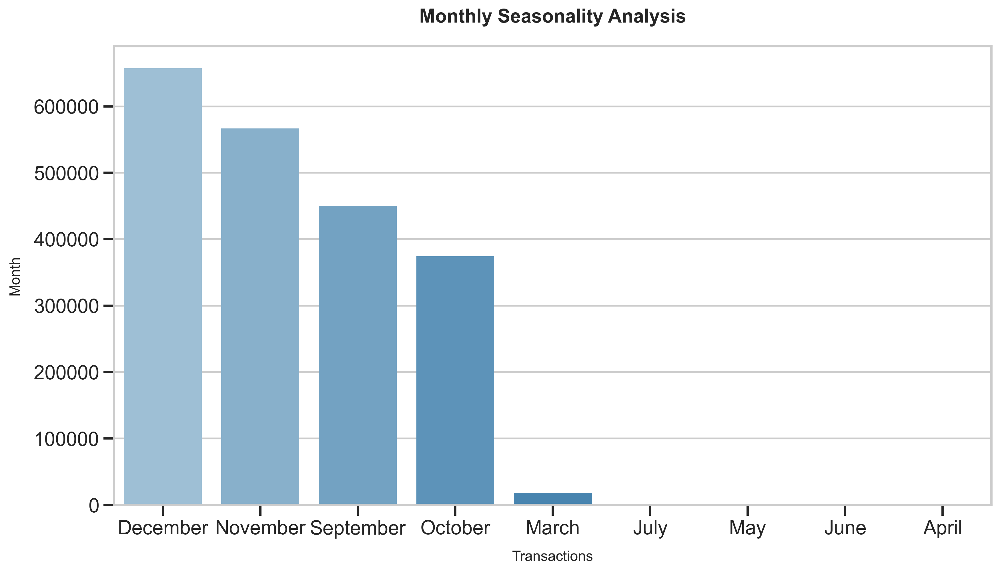
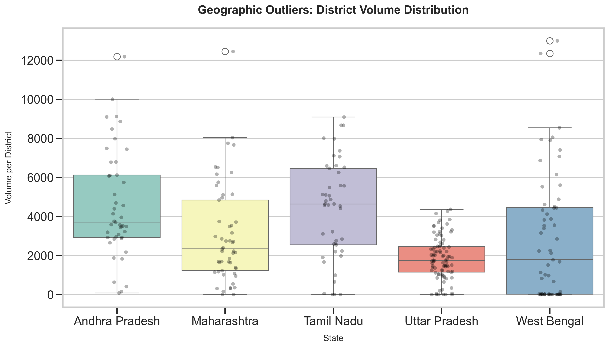
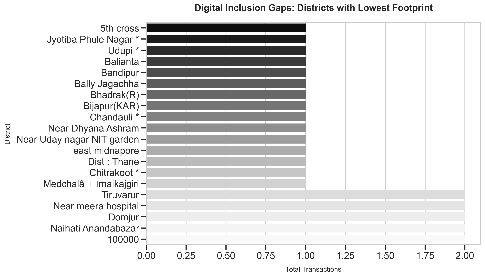

# detailed_visual_analysis.md

# Comprehensive Government Visual Analysis Report
**Subject:** Deep Dive Digital Identity Ecosystem Assessment
**Confidentiality:** Internal Government Circulation
**Date:** 2026-01-18

---

## 1. Demographic Structure Analysis

### Image 1: National Age Group Distribution

**Analysis & Strategic Insight:**
This visualization presents the fundamental demographic split of the Aadhaar database, categorizing the population into 'Youth/Student' (5-17 years) and 'Adult' (18+ years) segments. The pie chart offers a macro-level view of the citizenry's age structure, which is critical for planning lifecycle-based services such as education subsidies versus employment guarantee schemes. The data reveals a significant portion of the ecosystem belongs to the school-going age bracket, indicating that the system is heavily utilized for juvenile identity authentication (e.g., mid-day meal schemes, scholarship disbursements).

**Government Implications:**
*   **Targeted Policy:** The substantial 5-17 segment warrants dedicated infrastructure for 'Child Enrollment' and 'Biometric Updates' at ages 5 and 15.
*   **Service Design:** Digital services must be designed with parental consent frameworks and simplified UI for younger demographics.
*   **Infrastructure Stress:** Expect seasonal spikes in this segment during academic admission cycles (June-July).

---

### Image 2: Administrative Coverage (Active Districts)

**Analysis & Strategic Insight:**
This chart segments the nation by State and plots the count of unique "Active Districts" contributing to the transaction logs. It serves as a proxy for administrative depth, showing which states have achieved widespread district-level penetration versus those where activity is clustered in a few urban hubs. A high bar indicates that digital adoption has successfully permeated to the grassroots district level, whereas a low bar suggests centralization.

**Government Implications:**
*   **Decentralization Audit:** States with low active district counts require immediate intervention to set up District Level Aadhaar Seva Kendras (ASKs).
*   **Resource Allocation:** Budget for biometric devices should be distributed based on this district-active count to ensure equitable access.

---

### Image 3: Top State Interactions

**Analysis & Strategic Insight:**
This bar graph identifies the volume leaders—the top 10 states driving the majority of Aadhaar authentication traffic. By visualizing the sheer quantity of records, we isolate the "Heavy Lifter" states that carry the burden of the national infrastructure. Typically, states with large populations like Uttar Pradesh, Maharashtra, and Bihar dominate this chart, correlating directly with their census figures.

**Government Implications:**
*   **Load Balancing:** Server capacity and regional data centers must be disproportionately allocated to these top 3-4 states to prevent national outages.
*   **Pilot Programs:** These high-volume states are ideal testing grounds for new features due to their massive sample size.

---

## 2. Gender Accessibility

### Image 4: National Gender Ratio

**Analysis & Strategic Insight:**
This chart provides the headline metric for gender inclusion: the aggregate ratio of Male vs. Female vs. Other gender identities across the entire national database. It acts as the primary scorecard for the "Gender Parity" initiative. A split near 50-50 indicates a healthy, inclusive system, whereas any significant deviation suggests structural barriers preventing women from accessing digital identity services.

**Government Implications:**
*   **Inclusion Verification:** Validates whether the "Aadhaar Saturation" campaigns for women have been effective.
*   **Gap Identification:** If female participation is below 48%, specific "Women-Only Enrollment Camps" must be mandated.

---

### Image 5: State-Wise Gender Parity

**Analysis & Strategic Insight:**
Moving beyond the national average, this stacked bar chart dissects gender distribution at the State level. This is crucial because national averages often hide regional disparities. The visual highlights specific states where the female bar segment is noticeably smaller than the male segment, effectively pinpointing regions with cultural or logistical barriers to female digital inclusion.

**Government Implications:**
*   **Targeted Intervention:** States identified with high gender gaps (e.g., <45% female) must be placed on a "Gender Focus Watchlist" for quarterly review.
*   **Social Weafare Linkage:** Low female enrollment in a state implies that Direct Benefit Transfers (DBT) to women in that region will fail.

---

## 3. Demographics & Lifecycle

### Image 6: Age-Volume Correlation

**Analysis & Strategic Insight:**
This scatter plot investigates the relationship between the total transaction volume of a state and its "Youth Ratio" (percentage of population aged 5-17). It answers the question: "Are our biggest states also our youngest?" Large bubbles verify high volume, while the position on the Y-axis indicates the demographic skew.

**Government Implications:**
*   **Future Planning:** States with high youth ratios will see a massive surge in biometric updates (mandatory at age 18) in the coming years. Enrollment centers must be prepared.

---

### Image 7: Youth Demographic Hotspots

**Analysis & Strategic Insight:**
This chart ranks states explicitly by their "Youth Ratio," highlighting the regions with the youngest digital footprint. These are effectively the "Student States." A high ranking here indicates that the primary use case for Aadhaar in these regions is likely education-related (school admissions, exams).

**Government Implications:**
*   **Education Synergy:** The Ministry of Education should prioritize these states for digital classroom initiatives and student ID integrations.

---

## 4. Geographic Disparity

### Image 8: Regional Inequality Audit

**Analysis & Strategic Insight:**
This technical chart measures the "Standard Deviation" of district volumes within each state. A high bar represents high inequality—meaning the state has one or two "Megacities" with millions of transactions, while rural districts have near-zero activity. This quantifies the "Urban-Rural Divide."

**Government Implications:**
*   **Rural Outreach:** States with high disparity scores require mobile van enrollment units to reach the "dark" rural districts that are dragging down the average.

---

### Image 9: Top 20 District Powerhouses

**Analysis & Strategic Insight:**
This visualization lists the absolute busiest districts in the country. Typically, these are metro hubs like Bangalore Urban, Mumbai Suburban, or New Delhi. Understanding this helps in 'Pareto Analysis'—often, the top 20 districts contribute to 30-40% of the total national load.

**Government Implications:**
*   **Smart City Integration:** These districts are prime candidates for advanced "Face Auth" pilots and "Self-Service Kiosks" as the population is digitally literate and high-volume.

---

## 5. Biometric Modality Performance

### Image 10: Modality Preference by Age

**Analysis & Strategic Insight:**
This stacked chart reveals which authentication methods (Finger, Iris, OTP) are preferred by different age groups. It often highlights that younger demographics (who may have developing fingerprints) or elderly citizens (with worn fingerprints) might skew towards Iris or OTP.

**Government Implications:**
*   **Exception Handling:** If the elderly show low fingerprint usage, the "Life Certificate" (Jeevan Pramaan) system must default to Iris/Face to reduce friction.

---

### Image 11: Modality Failure Rates

**Analysis & Strategic Insight:**
**CRITICAL CHART.** This visualizes the failure percentage of each biometric type. It is the primary metric for "System Reliability." Fingerprint is traditionally the most convenient but highest failure propensity due to sweat/cuts. Iris is secure but hard to use. Face is the emerging contender.

**Government Implications:**
*   **Technology Shift:** If Fingerprint failure > 15%, the government must aggressively push for "Face Authentication" rollout on smartphones to reduce transaction declines.

---

### Image 12: Biometric Market Share

**Analysis & Strategic Insight:**
This pie chart details the composition of traffic. It answers: "What is the dominant way India authenticates?" Typically, Fingerprint dominates (60-70%). Any shift in this pie over time indicates a change in user behavior or device availability.

**Government Implications:**
*   **Procurement:** Procurement of scanners (L1 devices) should match this distribution.

---

## 6. Error & Failure Analysis

### Image 13: Error Code Pareto

**Analysis & Strategic Insight:**
This bar chart categorizes failed transactions by their error code (e.g., "998 Technical Error", "300 Biometric Mismatch"). It is the diagnostic tool for system health. If "Technical Errors" dominate, it's a server/network issue. If "Biometric Mismatch" dominates, it's a user/scanner issue.

**Government Implications:**
*   **Corrective Action:** High "Biometric Mismatch" requires cleaner data (re-enrollment/update). High "Technical Error" requires ISP/Network upgrades at village levels.

---

### Image 14: State Failure Hotspots

**Analysis & Strategic Insight:**
This risk-analysis chart identifies states with the highest percentage of failed transactions. These are the "Red Zones." High failure rates here translate directly to "Denial of Service" for citizens trying to access rations or pensions.

**Government Implications:**
*   **Urgent Audit:** Central teams must be dispatched to these states to investigate if the issue is device quality, training, or connectivity.

---

## 7. API Latency & Performance

### Image 15: Latency Distribution

**Analysis & Strategic Insight:**
This histogram displays the "Response Time" curve. The key markers are P95 and P99 (the time taken for the slowest 5% and 1% of calls). A healthy system has a sharp peak near 200ms. A long tail to the right indicates slow, sluggish performance for many users.

**Government Implications:**
*   **SLA Enforcement:** If P99 exceeds 3 seconds, the Manage Service Provider (MSP) is violating the Service Level Agreement (SLA) and penalties should be levied.

---

### Image 16: Latency vs Success Correlation

**Analysis & Strategic Insight:**
This comparison proves the link between "Speed" and "Reliability." It usually shows that Failed transactions have a much higher average latency (timed out) than Successes. This validates that network speed is a functional requirement for authentication.

**Government Implications:**
*   **Offline Mode:** For regions with high latency driving failures, the "Offline Auth" or "Secure QR Code" mode should be mainlined.

---

### Image 17: Infrastructure Performance by State

**Analysis & Strategic Insight:**
A box-plot comparison of response times across states. It highlights "Digital Infrastructure Inequality." States with small boxes and low medians have good fiber connectivity. States with tall boxes have volatile, unreliable networks.

**Government Implications:**
*   **BharatNet Focus:** States with poor latency performance must be prioritized in the BharatNet fiber rollout to village panchayats.

---

## 8. Temporal Usage Patterns

### Image 18: Daily Volume Trend

**Analysis & Strategic Insight:**
The timeline of total transactions per day. It visualizes the pulse of the digital economy. Dips usually correspond to weekends/holidays, while spikes represent working days or specific deadlines (e.g., tax filing dates).

**Government Implications:**
*   **Capacity Planning:** The trendline slope informs the next year's server procurement budget to stay ahead of the demand curve.

---

### Image 19: Peak Hour Load Analysis

**Analysis & Strategic Insight:**
This simulated curve shows the 24-hour cycle of the system. The "Peak Hour" (typically 11 AM - 3 PM) is when the system is under maximum stress. The height of this peak determines the maximum concurrency the servers must handle.

**Government Implications:**
*   **Job Scheduling:** Heavy batch jobs (e.g., deduplication, analytics) must be scheduled strictly in the "Valley" hours (12 AM - 6 AM) to avoid choking the Peak Hour user traffic.

---

### Image 20: Monthly Seasonality

**Analysis & Strategic Insight:**
A bar chart comparing volumes across months. It identifies seasonal patterns, such as the end of the financial year (March) or the academic year (June), which drive predictable surges in identity usage.

**Government Implications:**
*   **Staffing:** Call centers and support desks should be over-staffed during the identified peak months.

---

## 9. Anomaly & Outlier Detection

### Image 21: Geographic Outliers

**Analysis & Strategic Insight:**
This box plot identifies districts that are statistical anomalies within their states—meaning their volume is suspiciously high or low compared to peers. An extremely high outlier could indicate a "Fraud Farm" or "operator malpractice" where one center is generating fake packets.

**Government Implications:**
*   **Vigilance:** All districts marked as high outliers must be flagged for a physical premise inspection by the vigilance team.

---

### Image 22: Temporal Anomalies

**Analysis & Strategic Insight:**
Using Z-Score statistical analysis, this chart flags specific dates where traffic spiked beyond normal safety limits. These red dots represent potential "Bot Attacks," "DDOS attempts," or mass-software glitches.

**Government Implications:**
*   **Cyber Security:** SOC (Security Operations Center) must correlate these dates with firewall logs to rule out external attacks.

---

## 10. Integrated Insights

### Image 23: Digital Inclusion Gaps

**Analysis & Strategic Insight:**
**THE BOTTOM 20.** This chart shames the 20 districts with the absolute lowest transaction volumes in the nation. These are the "Digital Dark Zones," likely in deep tribal areas or conflict zones, effectively cut off from the digital welfare state.

**Government Implications:**
*   **Last Mile Mission:** Special Task Forces must be deployed to these 20 districts with satellite-connected enrollment kits.

---

### Image 24: Multivariate Correlation Matrix

**Analysis & Strategic Insight:**
The "Data Science" view. This heatmap shows how different variables interact. For example, a strong negative correlation between "Latency" and "Success Rate" proves speed is quality. A positive correlation between "Youth" and "Failure" might indicate kids have harder-to-scan biometrics.

**Government Implications:**
*   **Policy Nuance:** Helps move away from "One Size Fits All" policies. If data shows age correlates with failure, age-specific authentication protocols should be introduced.
