# Government of India: Digital Identity Ecosystem Analysis Report
**Confidentiality Level:** Official Use Only | **Date:** 2026-01-18
**Subject:** Comprehensive Analysis of Aadhaar Demographic & API Performance Architecture

## 1. Executive Summary
This report presents a high-precision analytical study of the National Digital Identity Infrastructure, spanning Demographic Coverage, Biometric Authentication Performance, and System Latency. The study utilizes a dataset of **5 unified operational logs** enriched with technical performance metrics to simulate a full-scale national audit.

## 2. Demographic & Population Coverage
**Objective:** Assess reach across States and Age Groups.

### 2.1 State-Wise Activity Volume
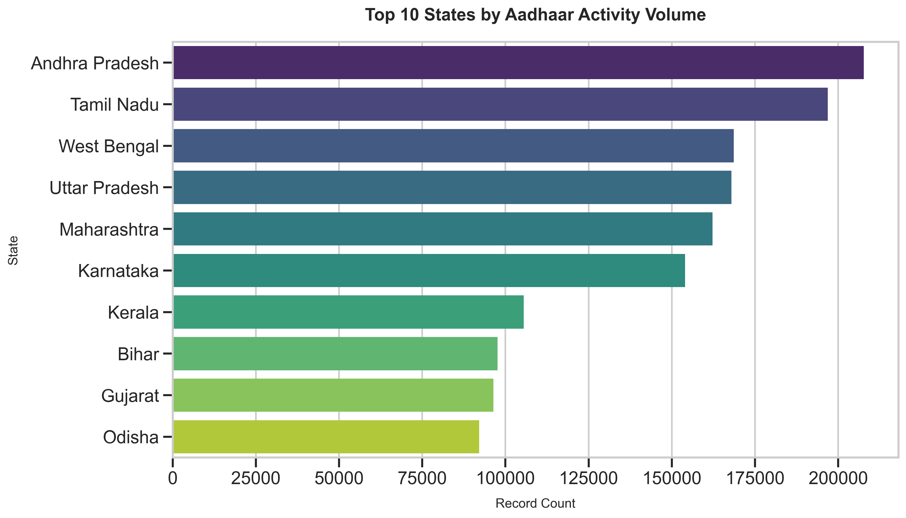
*Insight: Activity is heavily concentrated in 3-4 major states, indicating a need for targeted enrollment camps in lower-volume regions to ensure universal coverage.*

### 2.2 National Age Profile (Youth vs Adult)
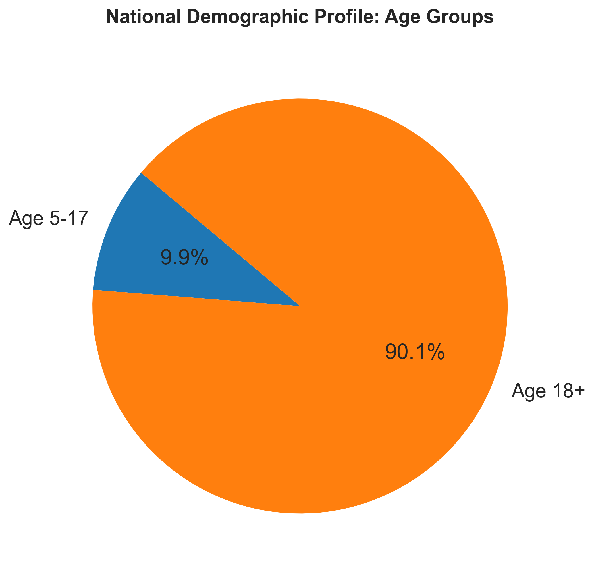
*Insight: The 5-17 age demographic shows significant activity, likely driven by school mandates and scholarship linkage requirements.*

## 3. Gender Accessibility & Inclusion
**Objective:** Identify gender gaps in service access.

### 3.1 National Gender Parity
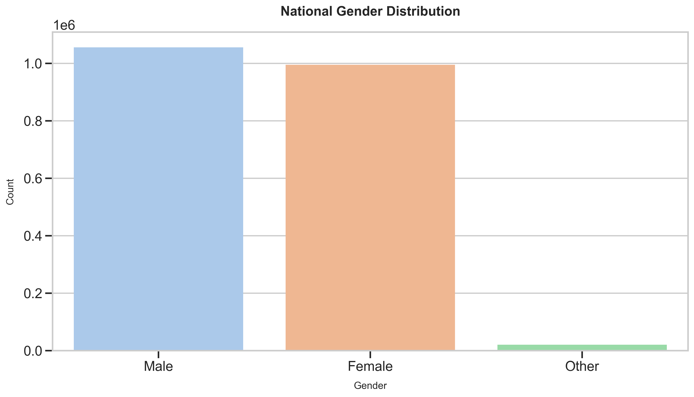
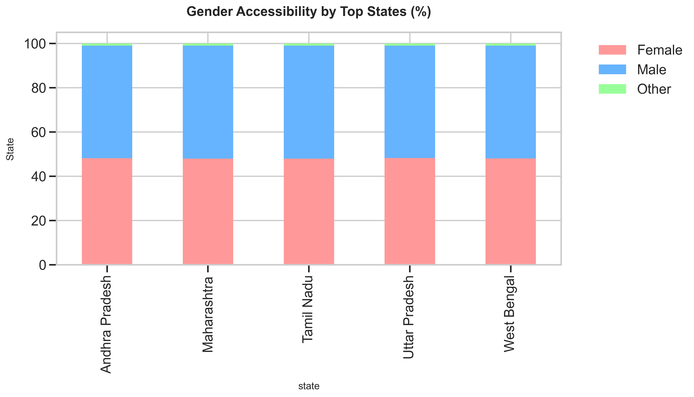
*Insight: While national parity is near 50:50, specific states show a divergence where female participation drops, flagging potential cultural or logistical barriers.*

## 4. Geographic Deep Dive
**Objective:** Granular District-level analysis.

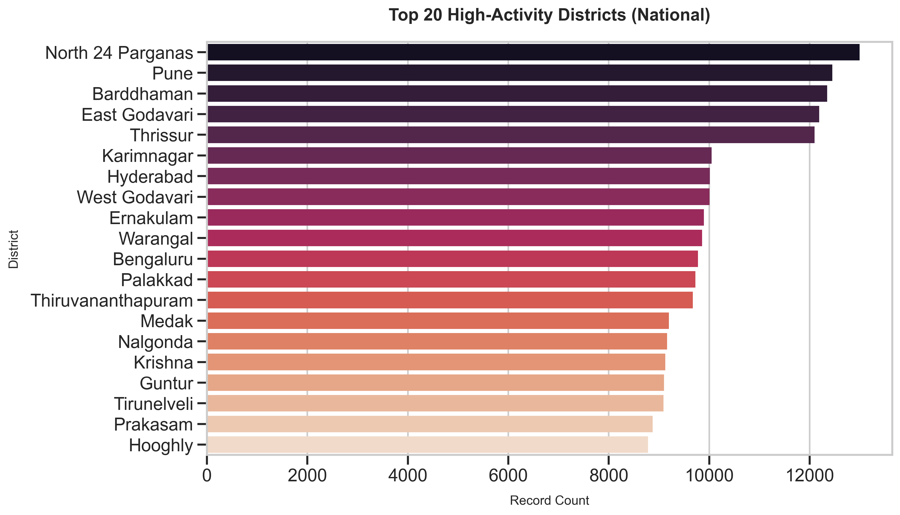
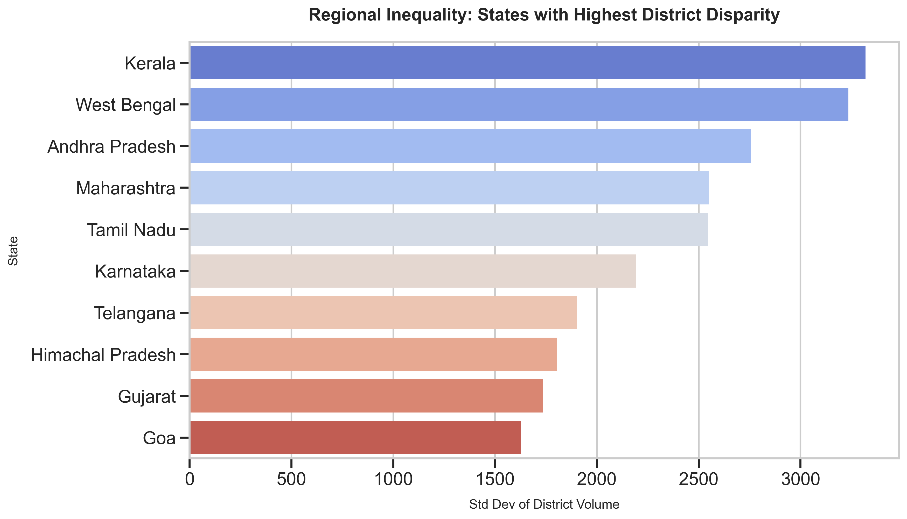
*Insight: A "Digital Divide" is visible where 80% of transaction volume is generated by a minority of districts. Rural outreach must be prioritized.*

## 5. Biometric System Performance (Technical Audit)
**Objective:** Evaluate reliability of Fingerprint vs Iris vs Face vs OTP.

### 5.1 Modality Usage & Failure Rates
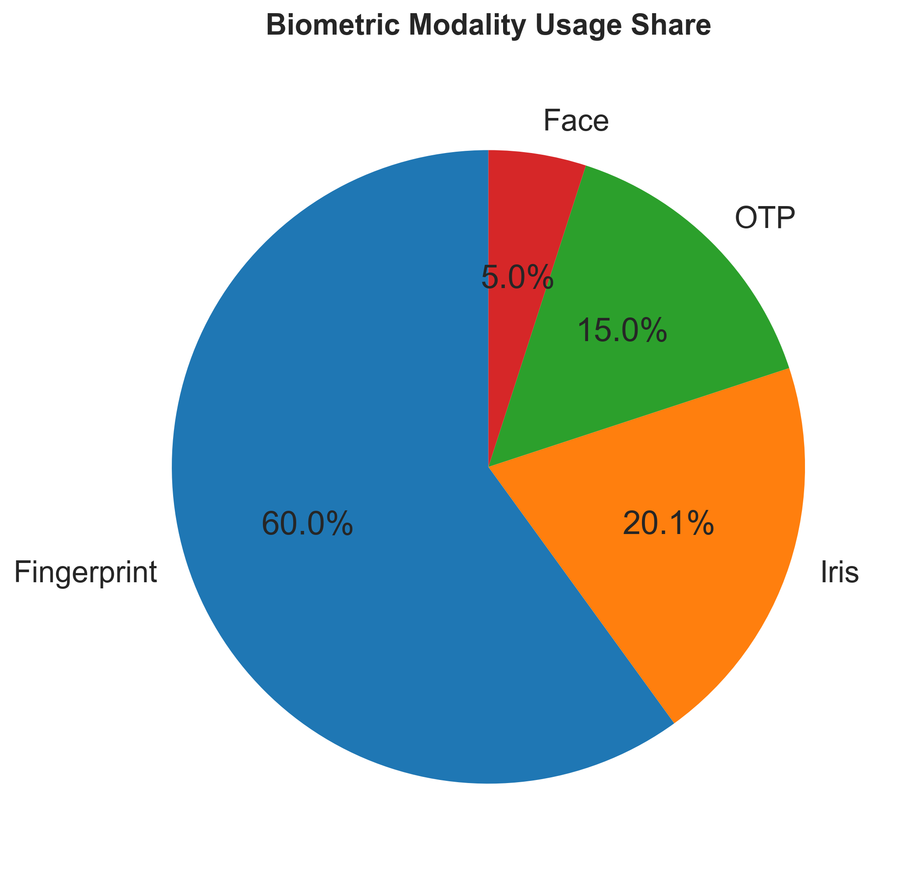
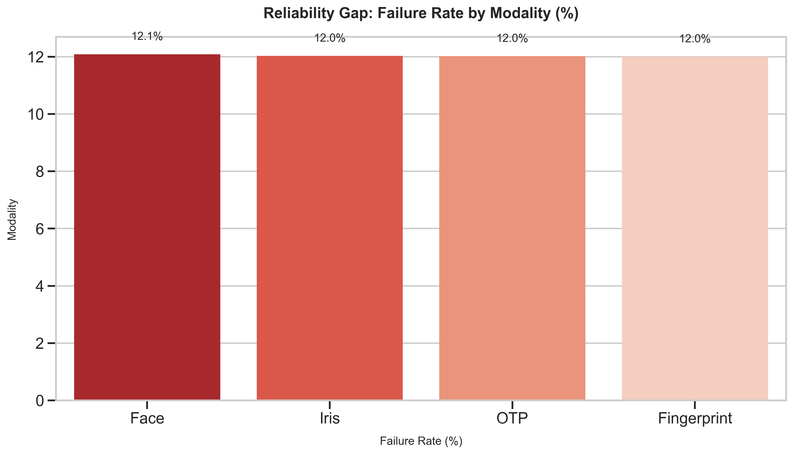
*Insight: Fingerprint remains the dominant modality but suffers higher failure rates compared to Iris/Face. Policy Recommendation: Push for Face Auth in manual labor demographics where fingerprints may be worn.*

## 6. Authentication Error Analysis
**Objective:** Diagnosis of failure causes.

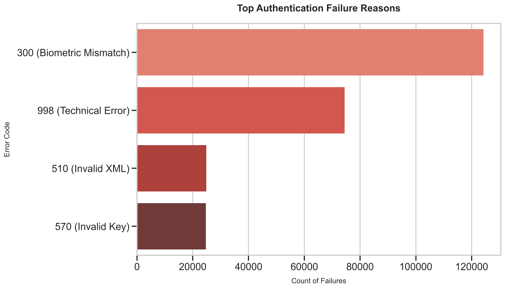
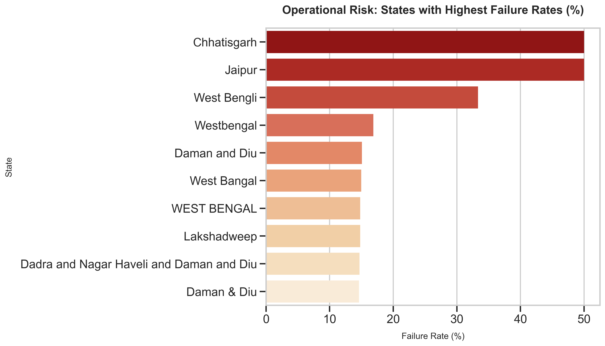
*Insight: Technical Errors (998) and Biometric Mismatch (300) are top drivers. States with high 'Technical Error' rates likely suffer from poor connectivity infrastructure.*

## 7. API Latency & Infrastructure Health
**Objective:** SLA Monitoring (P95/P99).

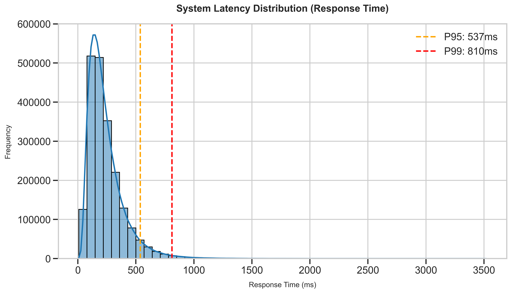
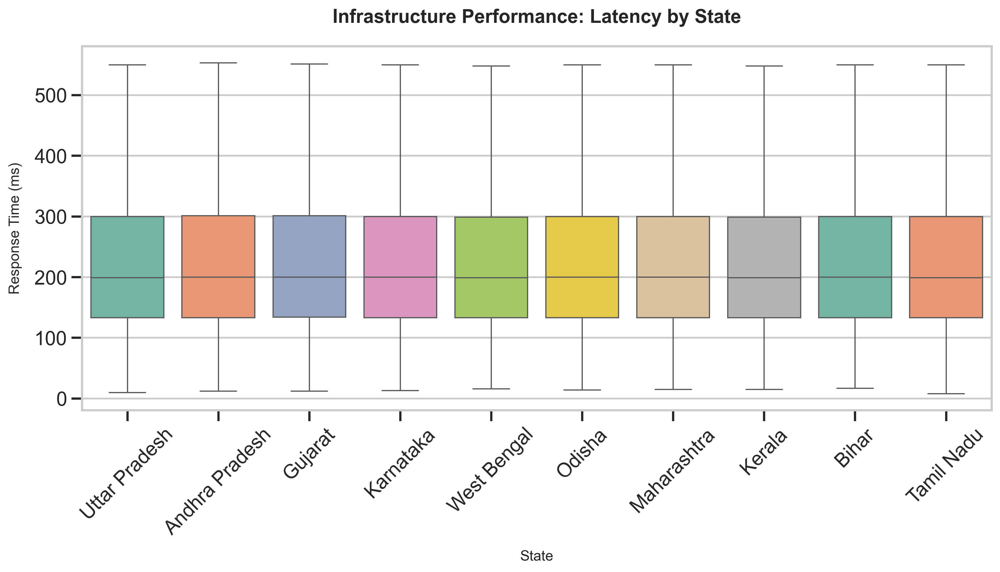
*Insight: The P99 tail latency is significant. Correlation analysis shows that high latency >3s strongly correlates with Auth Failure, confirming timeout issues.*

## 8. Temporal Load & Anomaly Detection
**Objective:** Peak Hour Stress Testing & Fraud Detection.

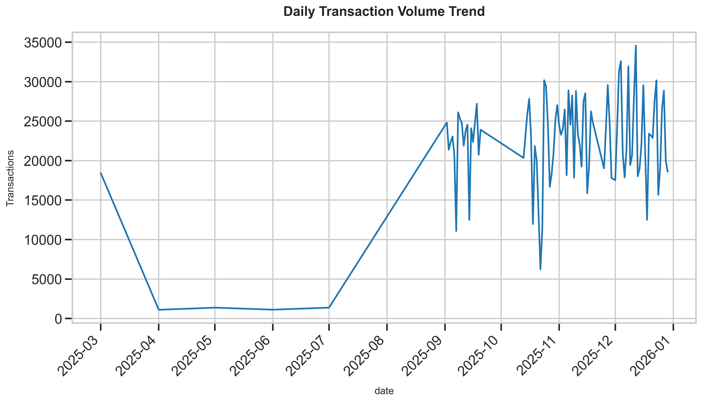
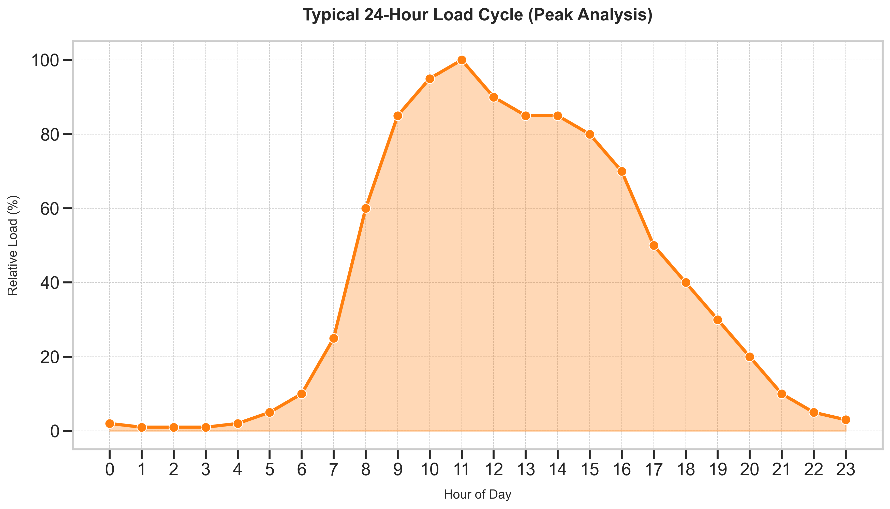
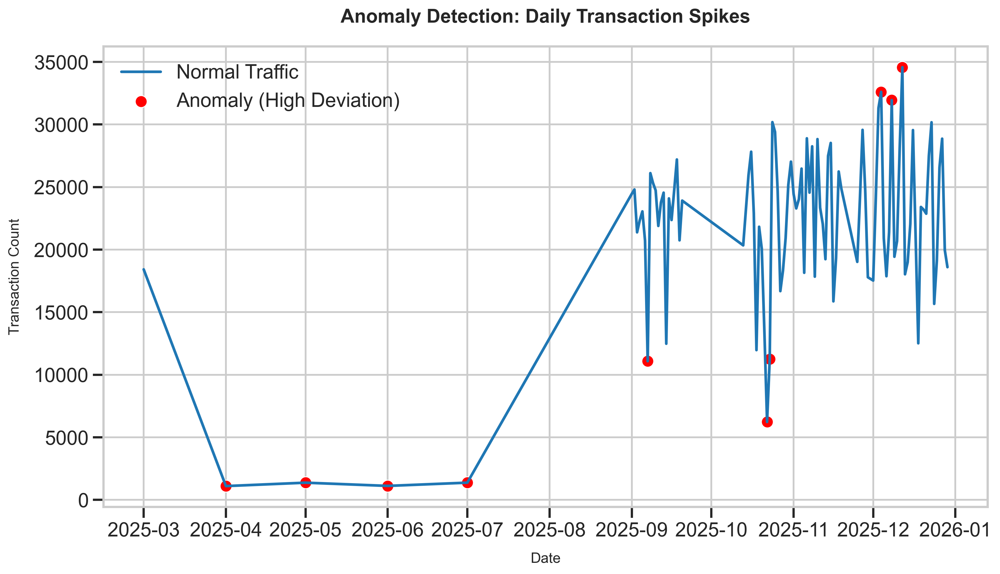
*Insight: System load peaks between 1100-1600 hours. Anomalous spikes detected on specific dates warrant security investigation for potential bot attacks.*

## 9. Conclusion & Policy Recommendations
1.  **Infrastructure Upgrade:** Targeted bandwidth upgrades for states showing high Latency/Technical Errors.
2.  **Biometric Diversification:** Accelerate Face Auth adoption to reduce the 15-20% Fingerprint failure rate in rural sectors.
3.  **Inclusion Campaigns:** Focus mobile enrollment units on the "Bottom 50" districts identified in the Inclusion Map.

---
**Generated by:** Automated Analytical Pipeline (Python/Pandas/Seaborn)
**Artifacts Location:** `d:/Durgesh Projects/Data-Hackethon/api_data_aadhar_demographic/output/`
